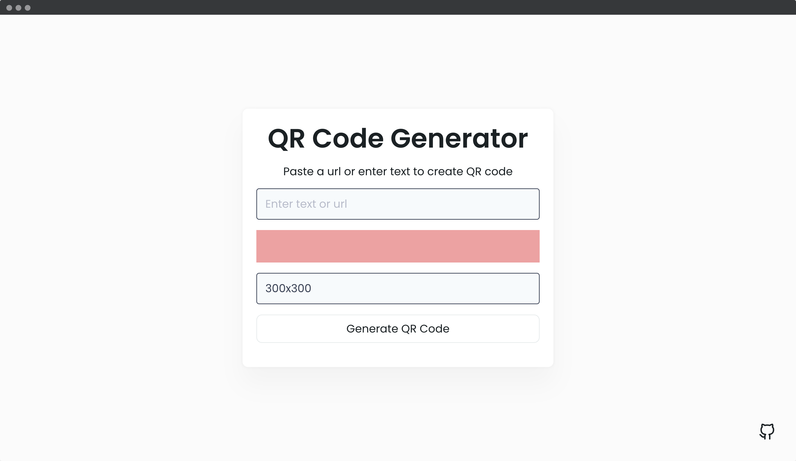
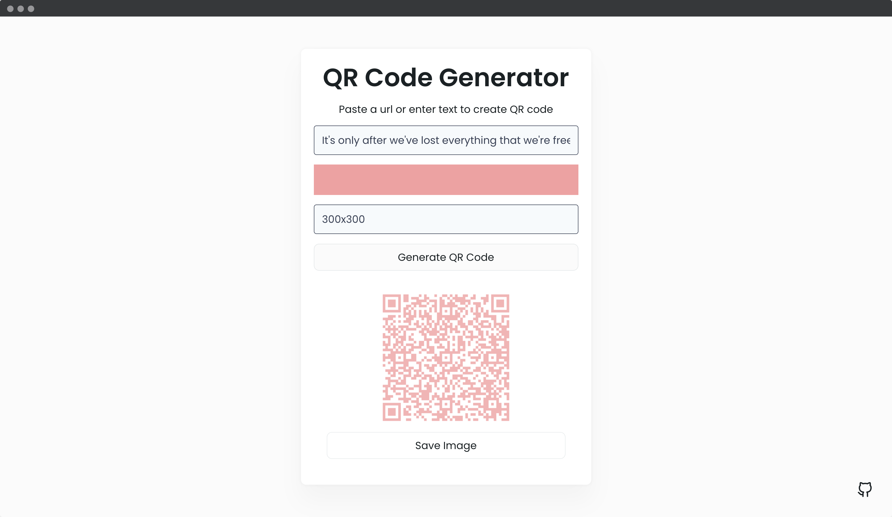

## 📦 QR Code Generator App

In this app, you can enter a text or URL to generate a QR code for it. QR (Quick Response) codes are capable of storing lots of data, and users can easily access the information by scanning the QR code.

---
#### 🌄 Screenshots:

-----

#### 💻 Stack:

- [JavaScript](https://learn.javascript.ru/)
- [Sass](https://sass-lang.com/)

#### 💻 API:
- [QRious](https://github.com/neocotic/qrious)
-----
#### 🙌 Author: [@nagoev-alim](https://github.com/nagoev-alim)
